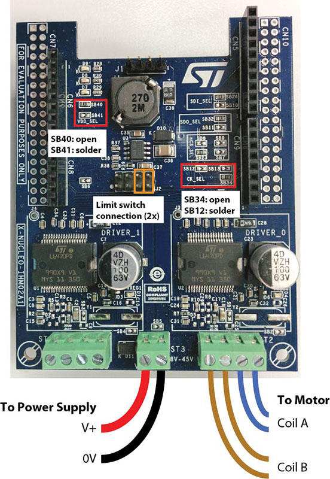

# Stepper Velocity Controller
An Arduino stepper motor controller for the X-NUCLEO-IHM02A1 stepper driver board. It accepts commands over *Serial* for (a) direct positioning of the stepper or (b) continuous tracking of a moving target.

## Setup and Installation

### Hardware
You will need:
- an Arduino Uno
- an X-NUCLEO-IHM02A1 stepper driver board
- a stepper motor
- a DC power supply with sufficient voltage and current for your motor
Before connecting the the driver board to the Arduino, you must modify a few solder jumpers on the XNucleo board, as shown in the diagram below. Next, connect the dirver to the Arduino and wire up the motor and power connections as shown in the diagram.

### Software
Download this repository and open up the `StepperVelocityController.ino` file in your Arduino software. You will need to customize several of the variable in the first few lines of the program for your particular motor and use case. These setup variables are clearly commented in the code (roughly on lines 10–50).

After you update these variables, save the code and upload the full program onto your Arduino.

## Use

Make sure the driver board is powered up. Then connect your Arduino to your PC using a USB cable. Open a 115200 baud serial connection to the Arduino (the simplest way to do this for testing is with the `Serial Monitor` in the Ardunio software.)

All Serial commands consist of a single-character command, followed by an optional numeric argument, followed by a `;` or an end-of-line character.

|Command(s)|Description|
|---|---|
|`S`,`A` \<no arg\>| Print `S` max speed or `A` acceleration rate |
|`S`,`A` \<value\>| Set `S` max speed or `A` acceleration rate |

### Examples

`G 90`: Go to the absolute position 90 units
`F 220`: Move forward 220 units

